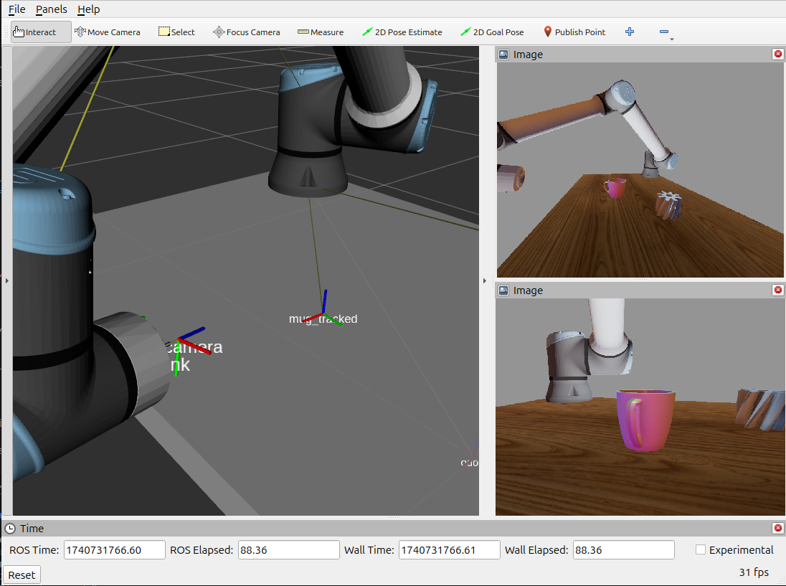

# obj_track_ros

Brings https://github.com/DLR-RM/3DObjectTracking to ROS2. With this package you can continuously track the pose of an object specified as mesh.



## Requirements

* ROS2
* OpenCV with modules:
  * core 
  * imgproc
  * highgui
  * imgcodecs
  * calib3d
  * features2d
  * **xfeatures2d** (not installed in debian distribution)
* yaml-cpp
* cv_bridge

## Build OpenCV

If you're running on ubuntu you likely need to compile OpenCV yourself as debian does not ship the module xfeatures2d (from opencv_contrib). See https://docs.opencv.org/4.x/d7/d9f/tutorial_linux_install.html. A build script could look like so: 
```bash
#!/bin/bash
cd opencv
mkdir build
cd build

cmake -DCMAKE_BUILD_TYPE=RELEASE -DCMAKE_INSTALL_PREFIX=/home/USER/.local/ -DOPENCV_EXTRA_MODULES_PATH=../../opencv_contrib/modules -DBUILD_opencv_xfeatures2d=ON ..

make -j8
make install
```

This script requires `opencv` and `opencv_contrib` to be in the same directory as the script.

## Build

Clone this repo _recursively_ with `git clone --recursive https://gitlab.dlr.de/mo-repo/rar/obj_track_ros.git`

Run `colcon build --symlink-install` as usual.

## Run

See in `/launch` and `/config` for a concrete working example.

You'll only need to supply a list of rgb/depth camera config files to be able to start the node:

```yaml
- name: color_camera
  type: Ros2ColorCamera
  image_topic: /your_camera_image_topic
  info_topic: /your_camera_info_topic
  frame: the_cameras_frame
  publish_overlay: true

- name: depth_camera
  type: Ros2DepthCamera
  image_topic: /depth_image_topic
  info_topic: /depth_camera_info
  frame: the_cameras_frame
  scale: 1.0
```

During runtime, you can then send `TrackedObject` messages to start tracking one specific object.

```text
string name
string geometry_path
string frame

float32 geometry_unit_in_meter 1.0
bool geometry_counterclockwise true
bool geometry_enable_culling false
float32[16] geometry2body_pose [1.0, 0.0, 0.0, 0.0, 0.0, 1.0, 0.0, 0.0, 0.0, 0.0, 1.0, 0.0, 0.0, 0.0, 0.0, 1.0 ]
float32[16] detector_world_pose [1.0, 0.0, 0.0, 0.0, 0.0, 0.0, -1.0, 0.05, 0.0, 1.0, 0.0, 0.5, 0.0, 0.0, 0.0, 1.0 ]

```